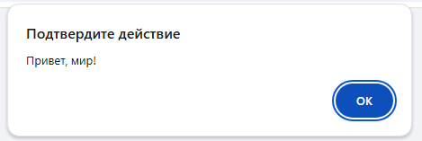
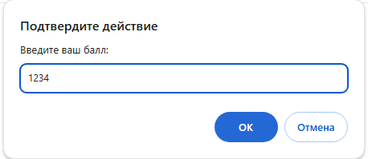
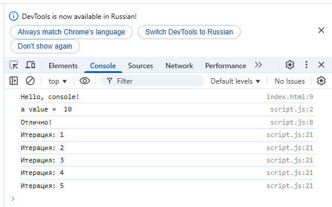

# **Лабораторная работа №1:** *Введение в JavaScript*

__Студент:__  *Пармакли Леонид IA2404ru*  
__Проверил:__  *Алексей Муринец*  
__Дата:__ 12.02.2024
*[Основная ветка репозитория](https://github.com/IA204JavaScript/labworks_leopard187/tree/Lab1)*

---

## 1. Инструкции по запуску проекта

Проект представляет собо тестовый сайт для запуска сценария JavaScript, поэтому достаточно клонировать  
репозиторий, запустить файл index.html и зайти в консоль (F12) для проверки результата. 

```bash
git clone --single-branch -b Lab1 https://github.com/IA204JavaScript/labworks_leopard187.git
```

## 2. Скриншоты работы сценариев

Скрипт внутри HTML кода
```html
    <script>
        alert("Привет, мир!");
        console.log("Hello, console!");
    </script>
```


---

Ввод значения:
```js
    let score = prompt("Введите ваш балл:");
```


---
Результат работы сценариев в консоли Chrome:
```js
    if (score >= 90) 
    {
        console.log("Отлично!");
    } 
    else if (score >= 70) 
    {
        console.log("Хорошо");
    } 
    else 
    {
        console.log("Можно лучше!");
    }

    for (let i = 1; i <= 5; i++) 
    {
        console.log(`Итерация: ${i}`);
    }
```

