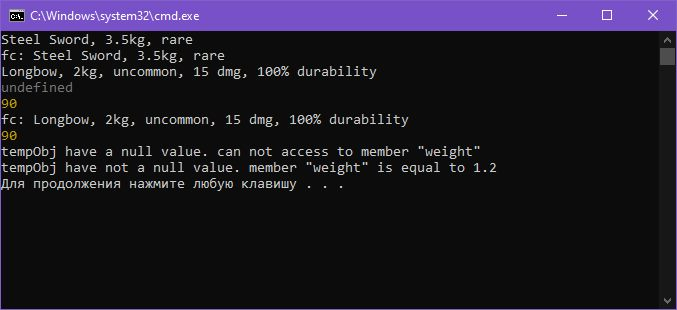

# **Лабораторная работа №3:** *Работа с массивами в JavaScript*

__Студент:__  *Пармакли Леонид IA2404ru*  
__Проверил:__  *Алексей Муринец*  
__Дата:__ 13.04.2025

*[Основная ветка репозитория](https://github.com/IA204JavaScript/labworks_leopard187)*

---

## 1. Инструкции по запуску проекта

Проект представляет собой сценарнй файл, исполняемый платформой Node.Js. Для запуска проекта требуется клонировать репозиторий, и запустить файл start.bat.

```bash
git clone --single-branch -b Lab3 https://github.com/IA204JavaScript/labworks_leopard187.git
```


## 2. Задание

Создайте консольное приложение, моделирующее систему инвентаря, где можно добавлять предметы, изменять их свойства и управлять ими.

Создайте класс `Item`, который будет представлять предмет в инвентаре.

- **Поля класса**:
  - `name` – название предмета.
  - `weight` – вес предмета.
  - `rarity` – редкость предмета (`common`, `uncommon`, `rare`, `legendary`).
- **Методы**:
  - `getInfo()` – возвращает строку с информацией о предмете.
  - `setWeight(newWeight)` – изменяет вес предмета.

Создайте класс `Weapon`, который расширяет `Item`.

- **Дополнительные поля**:
  - `damage` – урон оружия.
  - `durability` – прочность (от 0 до 100).
- **Методы**:
  - `use()` – уменьшает `durability` на 10 (если `durability > 0`).
  - `repair()` – восстанавливает `durability` до 100.

**Опциональная цепочка** `(?.)` - используйте ее при доступе к свойствам объекта, чтобы избежать ошибок.

**Создание функции-конструктора** - Перепишите классы `Item` и `Weapon`, используя **функции-конструкторы** вместо `class`.


## 3. Скриншоты работы 

Выполнение скрипта:  



## 4. Контрольные вопросы

1. Какое значение имеет `this` в методах класса?
    - this ссылается на сам объект. В функциях-конструкторах позволяет задать свойства и вернуть их в виде объекта.

2. Как работает модификатор доступа `#` в JavaScript?
    - модификатор доступа `#` является модификатором private и не позволяет получить доступ к полю или методу вне класса.

3. В чем разница между `классами` и `функциями-конструкторами`?
    - Функция-конструктор создает объект и является старым методом работы с объектами. Классы являются новым методом работы с ООП и полноценно реализуют наследование, а так же модификаторы доступа. 