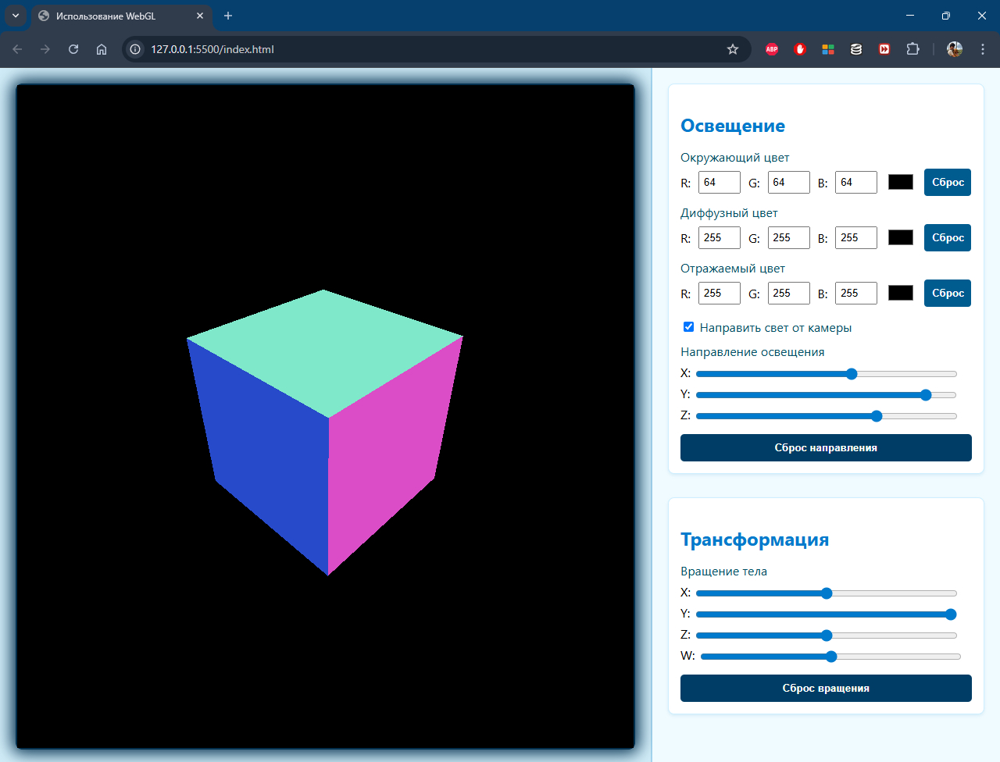

# **Индивидуальная работа:** *Работа с графической библиотекой Three.js на базе WebGL*

__Студент:__  *Пармакли Леонид IA2404ru*  
__Проверил:__  *Алексей Муринец*  
__Дата:__ 22.05.2025

*[Основная ветка репозитория](https://github.com/IA204JavaScript/labworks_leopard187)*

---

## 1. Инструкции по запуску проекта.

1. Клонирование репозитория:
```
git clone --single-branch -b IndWork https://github.com/IA204JavaScript/labworks_leopard187.git
```

2. Требуется установить Visual Studio Code с расширением LiveServer.
3. Запуск скрипта vscode.bat для запуска visual studio
4. Открытие файла [`./index.html`](./index.html)
5. Клавиша F1 ввод *"Live Server"* и выбор *"Open With Live Server"*  


## 2. Автор проекта.
Автором данного проекта является студент *Леонид (@leopard) Пармакли*. Он является большим любителем языка С++ и компьютерной графики. Любит поиграть в игры. Не любит веб-программирование. **Ненавидит компьютерные сети.**


## 3. Описание проекта. Цель. Основные функции. Код.

**Описание:**

- *Данный проект является тестовым. Так как у автора присутствует интрес к программированию компьютерной графики с прямым участием графического процессора, была выбрана данная тема как изучение возможностей веб-программирования с графикой.*

- *Целью данного проекта изначально было написание простого просмотрщика моделей, однако объем работы был достаточно высок и было отклонение от требований к индивидуальной работе. Наработки использованы для реализации самых базовых функций для работы с графикой и сценой.

- *Основной функцией является добавление и удаление объектов в сцене. Написанные прослойки для работы с освещением и камерой позволяют расширить функционал до полноценного редактора уровня для игры. К дополнительным возможностям относится возможность изменить освещения для просмотра внешности объекта в разных условиях*

**Программный код разделен на модули:**

- [`./scripts/__main.js`](./scripts/__main.js) - Условная точка входа в приложение.
- [`./scripts/__control.js`](./scripts/__control.js) - Система ввода через мышь
- [`./scripts/__light.js`](./scripts/__light.js) - Класс освещения 
- [`./scripts/__render.js`](./scripts/__render.js) - Главный класс приложения
- [`./scripts/__object.js`](./scripts/__object.js) - Класс объекта, добавляемого в сцену
- [`./scripts/__ui.js`](./scripts/__ui.js) - Регистрируемые события графического интерфейса
- [`./scripts/__camera.js`](./scripts/__camera.js) - Класс камеры
- [`./scripts/__mymath.js`](./scripts/__mymath.js) - Ручная реализация классов цвета и трехмерного вектора, используемых в классах камеры, объекта и освещения.

**Принцип работы кода:**

- Приложение начинает свою работу с инициализации. В данном приложении требуется инициализировать события, отправляемые с элементов графического интерфейса. Дополнительно требуется инициализиовать ввод мыши. Данные функции реализованы в файлах [`./scripts/__ui.js`](./scripts/__ui.js)  и [`./scripts/__control.js`](./scripts/__control.js) 

- Каждое приложение имеет цикл, в котором происходит его обновление состояний и даное прриложение не исключение. Главный класс имеет две функции: `update` и `render`. Первая обновляет состояния камеры и освещения. Вторая рисует всю сцену с обновленными параметрами. Данные функции вызываются в общей функции `workRender`, которая зарегистрирована в Three.js для циклического вызова функции.   

- Файл [`./scripts/__main.js`](./scripts/__main.js) состоит из вызовов трех функций.
    ```js
    ui.initUI();
    control.initControls();
    render.workRender();
    ```


**Интересные моменты в коде:**

-   Функции инициализации объекта и его создания в сцене: [`./scripts/__object.js`](`./scripts/__object.js`)
```js
    respawnObject() {
        let dist = getCamera().getDistance();

        let x = Math.random() * (dist * 1.5) - dist * 0.75;
        let y = Math.random() * (dist * 1.5) - dist * 0.75;
        let z = Math.random() * (dist * 1.5) - dist * 0.75;

        this.#position.set(x, y, z);
    }

    initRenderable(scene) {
        if(this.#type === "cube")
            this.#geometry = new THREE.BoxGeometry(1, 1, 1);

        if(this.#type === "cylinder")
            this.#geometry = new THREE.CylinderGeometry(0.5, 0.5, 1.0);

        if(this.#type === "sphere")
            this.#geometry = new THREE.SphereGeometry(0.5);

        let col = Math.floor(Math.random() * 0xffffff);
        let specPower = Math.random() * 100;
        let spec = Math.floor(Math.random() * 0xffffff);

        this.#material = new THREE.MeshPhongMaterial({
            color: col,
            specular: spec,
            shininess: specPower
        });
  
        this.#mesh = new THREE.Mesh(this.#geometry, this.#material);
        scene.add(this.#mesh);
    }
```

-   Обновление камеры: [`./scripts/__camera.js`](./scripts/__camera.js)
```js
    update(mouseMovedX, mouseMovedY) {
        let d = this.#dist;
        let py = 0.0;
        let px = 0.0;
        let pz = 0.0;
        let radius = 0.0;

        this.#angleY += mouseMovedY * 0.0025;
        this.#angleXZ += mouseMovedX * 0.0025;

        py = Math.sin(this.#angleY) * d;
        radius = Math.cos(this.#angleY);

        px = Math.sin(-this.#angleXZ) * d * radius;
        pz = Math.cos(this.#angleXZ) * d * radius;

        this.#eye.set(px, py, pz);
    }
```

- Обновления состояния мыши: 
```js
    const mouseState = {
        x: 0,
        y: 0,
        prevX: 0,
        prevY: 0,
        diffX: 0,
        diffY: 0,
        pressed: false
    }
    ...
    const renderTarget = document.getElementById("renderTargetOutput");
    ...
    renderTarget.addEventListener("mousemove", function(event) {
        mouseState.prevX = mouseState.x;
        mouseState.prevY = mouseState.y;

        mouseState.x = event.screenX;
        mouseState.y = event.screenY;

        if(event.buttons === 4 && mouseState.pressed) {
            let diffX = mouseState.x - mouseState.prevX;
            let diffY = mouseState.y - mouseState.prevY;
            mouseState.diffX = diffX;
            mouseState.diffY = diffY;
            getCamera().update(diffX, diffY);
        }
    });
```

## 4. Скриншоты. Этапы разработки

1. Изначально планировалась работа с одним объектом, и поэтому изначально была доступна настройка трансформации объекта.
 

2. Позднее были подключены все события к элемнтам управления. Инициализирована работа Three.js с рендерингом куба в отдельный элемент документа, по-умолчанию установлен полноэкранный body. Изначальный материал обозначал напралвение поверхностей через цвет сторон куба.


3. Далее была внедрена система массива объектов, для добавления и удаления объектов в сцене. Добавлен нужный интерфейс на страницу вместо трансформаций. Добавлено управление камерой через колесико мыши при помощи событий mousemove, mouseup, mousedown и wheel.
 

4. ПОлностью реализована система добавления/удаления объектов в сцене.


5. Добавлнные объекты в сцене отображаются в таблице. Выбран другой материал для освщения объектов. Для каждого объекта рандомно генерируется цвет, отражаемость и цвет отражаемого света. Убраны лишние элементы управления для выбора цвета глобального освещения. Цвет освещения теперь применяется к объектам. Управление объектами перемещено наверх.  


## 5. Список источников.

[Основная информация о WebGL на сайте разработчика Khronos Group](https://www.khronos.org/webgl/)

[Официальный сайт Three.js](https://threejs.org/)

[Документация по Three.js](https://threejs.org/docs/)

[Репозиторий проекта Three.js](https://github.com/mrdoob/three.js/)

[Обучающие материалы по JS (W3Schools)](https://www.w3schools.com/js/DEFAULT.asp)

[Обучающие материалы по JS (Metanit)](https://metanit.com/web/javascript/)


## 6. Дополнительные аспекты.

- Графические API, такие как OpenGL, Direct3D, Vulkan или Metal, требуют более продвинутых знаний в математике, а именно линейной алгебры и аналитической геометрии. Например, для понимания принципа работы камеры или освещения.
- Все графические конвейеры в конечном итоге выводят один кадр на экран, что в свою очередь является тем же двумерным изображением. Это изображение в конечном итоге выводится в блок и его можно сохранить как картинку в контекстном меню, нажав по элементу правой кнопкой мыши.
- Three.js является более высокоуровневым графическим API с использованием WebGL, нежели прямое испльзование WebGL. WebGL требует ручного управления ресурсами, ручного управления контекстами графических устройств для рендера, управления шейдерами. Three.js предоставляет полностью готовые системы управления ресурсами, включая дополнительную систему, а именно систему управления сценой.