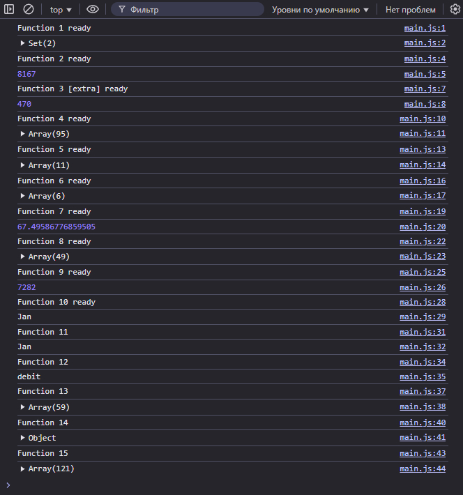
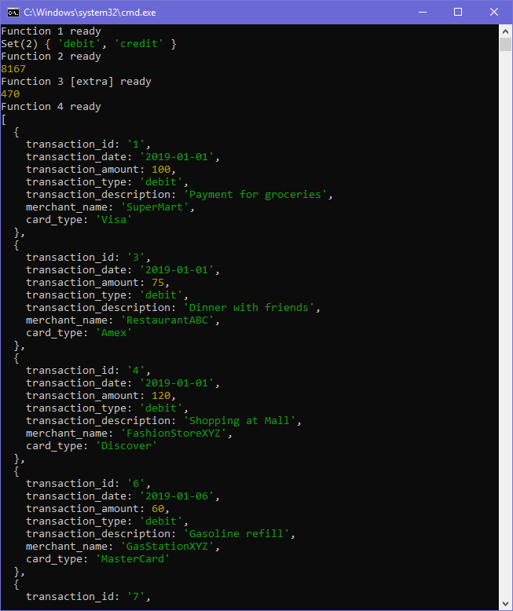

# **Лабораторная работа №2:** *Работа с массивами в JavaScript*

__Студент:__  *Пармакли Леонид IA2404ru*  
__Проверил:__  *Алексей Муринец*  
__Дата:__ 26.02.2024

*[Основная ветка репозитория](https://github.com/IA204JavaScript/labworks_leopard187)*

---

## 1. Инструкции по запуску проекта

Проект представляет собой надой сценарных файлов, исполняемых платформой Node.Js. Для запуска проекта требуется клонировать репозиторий, и запустить файл start.bat.

```bash
git clone --single-branch -b Lab2 https://github.com/IA204JavaScript/labworks_leopard187.git
```

## 2. Задание

1. Создание массива объектов, описывающих транзакцию, и имеющих следующие свойства: 
   - `transaction_id` - уникальный идентификатор транзакции.
   - `transaction_date` - дата транзакции.
   - `transaction_amount` - сумма транзакции.
   - `transaction_type` - тип транзакции (приход или расход).
   - `transaction_description` - описание транзакции.
   - `merchant_name` - название магазина или сервиса.
   - `card_type` - тип карты (кредитная или дебетовая).

2. Создание функций для работы с данным массивом транзакций
    1. `ПetUniqueTransactionTypes(transactions)`
        - Возвращает массив уникальных типов транзакций.
    2. `CalculateTotalAmount(transactions)`
        - Вычисляет сумму всех транзакций.
    3. `CalculateTotalAmountByDate(transactions, year, month, day) [extra]`
        - Вычисляет общую сумму транзакций за указанный год, месяц и день.
    4. `GetTransactionByType(transactions, type)`.
        - Возвращает транзакции указанного типа.
    5. `GetTransactionsInDateRange(transactions, startDate, endDate)`
        - Возвращает массив транзакций, проведенных в указанном диапазон дат от `startDate` до `endDate`.
    6. `GetTransactionsByMerchant(transactions, merchantName)`
        - Возвращает массив транзакций, совершенных с указанным `merchantName`.
    7. `CalculateAverageTransactionAmount(transactions)`
        - Возвращает среднее значение транзакций.
    8. `GetTransactionsByAmountRange(transactions, minAmount, maxAmount)`
        - Возвращает массив транзакций с суммой в заданном диапазоне от `minAmount` до `maxAmount`.
    9. `CalculateTotalDebitAmount(transactions)`
        - Вычисляет общую сумму дебетовых транзакций.
    10. `FindMostTransactionsMonth(transactions)`
        - Возвращает месяц, в котором было больше всего транзакций.
    11. `FindMostDebitTransactionMonth(transactions)`
        - Возвращает месяц, в котором было больше дебетовых транзакций.
    12. `MostTransactionTypes(transactions)`
        - Возвращает каких транзакций больше всего.
    13. `GetTransactionsBeforeDate(transactions, date)`
        - Возвращает массив транзакций, совершенных до указанной даты.
    14. `FindTransactionById(transactions, id)`
        - Возвращает транзакцию по ее уникальному идентификатору.
    15. `MapTransactionDescriptions(transactions)`
        - Возвращает новый массив, содержащий только описания транзакций.


## 3. Примечания
1. Разработка изначально была нацелена на выполнение в браузере. 
2. Из-за большого объема написанного кода, скрипт был разделен на 4 файла:
    - `main.js` - Основной исполняемый файл сценария JavaScript.
    - `transactions_lib.js` - Библиотека функций для работы с транзакциями.
    - `help_lib.js` - Вспомогательные функции, написанные для упрощения кода в некоторых места.
    - `transactions.js` - Массив из 121 объекта транзакций.
3. Так как проект был разделен и был совершен переход на выполнение в Node.Js, взаимодействие между файлами реализована при помощи модульности. При помощи ключевого слова `export` функции/переменные будут доступны извне, а чтобы их использовать, файл, вызывающий экспортированную функцию, должен импортировать функции/переменные. Например:
```js
// transactions_lib.js
export function GetUniqueTransactionTypes(...)
{
    ...;
}

// main.js
import {GetUniqueTransactionTypes} from "./transactions_lib.js"
```

## 4. Скриншоты работы 

Выполнение скрипта в Google Chrome, до рефактора в скрипт Node.Js:


Выполнение скрипта в Node.Js:
